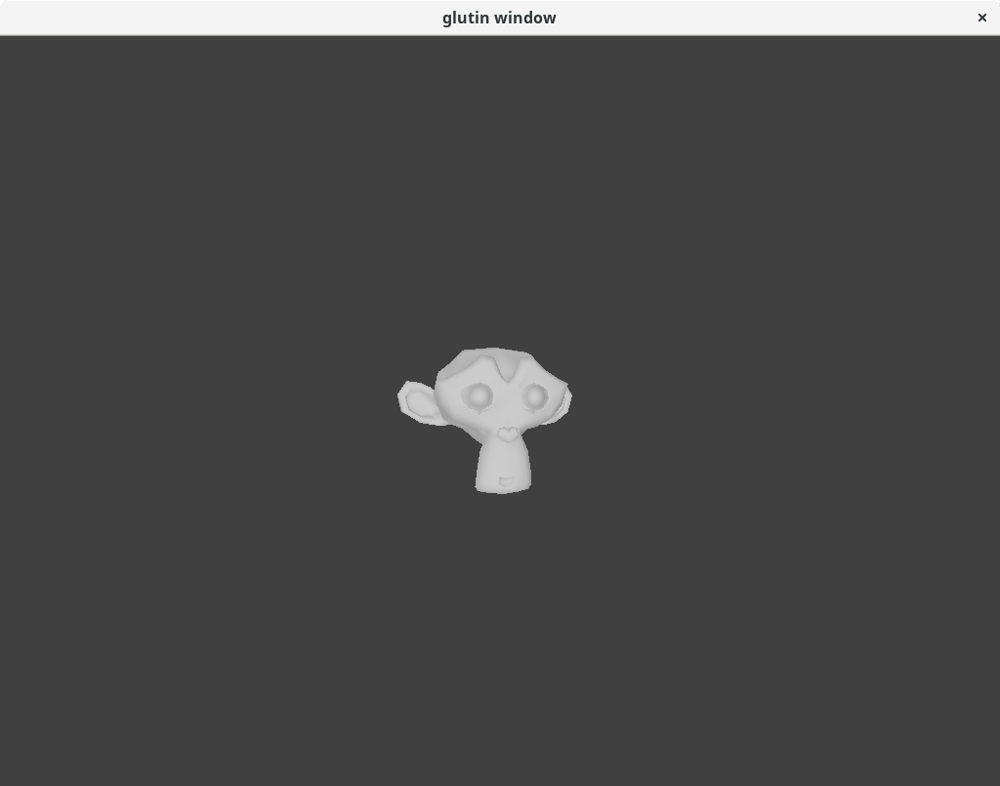

# rust-vulkan-test
A small program for learning vulkan/vulkano.

The Program Running on My Laptop with a GTX 960M (>3000 FPS)

### Dependencies
* Vulkan Headers
* Cargo
* Dash or equivalent
* GNU Coreutils or equivalent
* Gawk or equivalent
* Rsync
* XZ Utils
